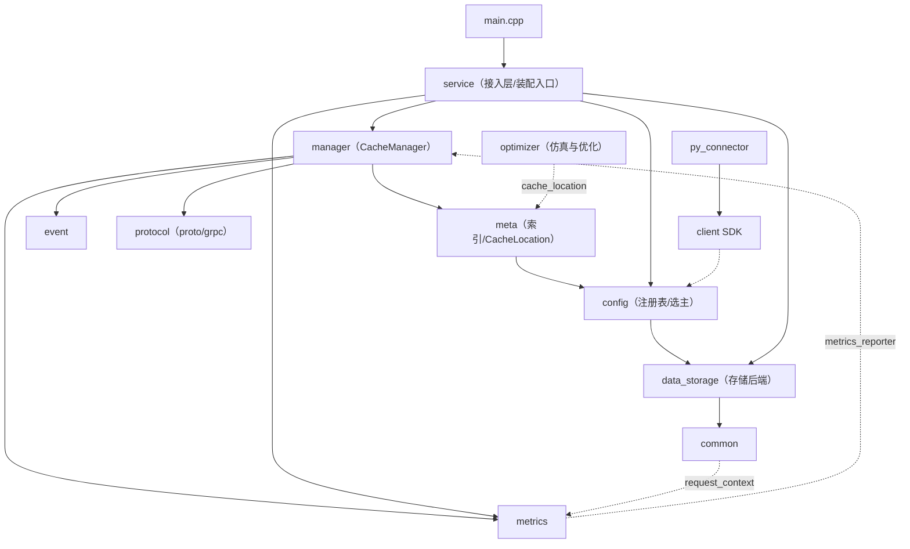

# AGENTS.md

项目文档见 [docs/README.md](docs/README.md)。
提交前检查和 commit message 格式见 [docs/develop/commit_requirements.md](docs/develop/commit_requirements.md)。

## 模块关系（缩略图）

修改功能前先确认当前模块的上下游约束，避免遗漏关联模块。完整职责说明、运行时数据流/控制流、以及各模块的关联性检查清单见 **[模块架构与关联关系](docs/design/module_architecture.md)**。

服务端核心依赖链（单向下降）：`service → manager → meta → config → data_storage → common`。

> 若模块职责、依赖方向或调用关系变动，或新增/删除模块，请同步更新本图与 [docs/design/module_architecture.md](docs/design/module_architecture.md)。

## 约束

- **Instance 隔离**：KVCache 仅在同一个 `instance_id` 内复用，跨 Instance 不匹配。

<!--
约束收录原则：只放会导致方向性错误的系统级约束，不放通用工程实践。
组件级实现细节放在对应模块文档中。
-->
