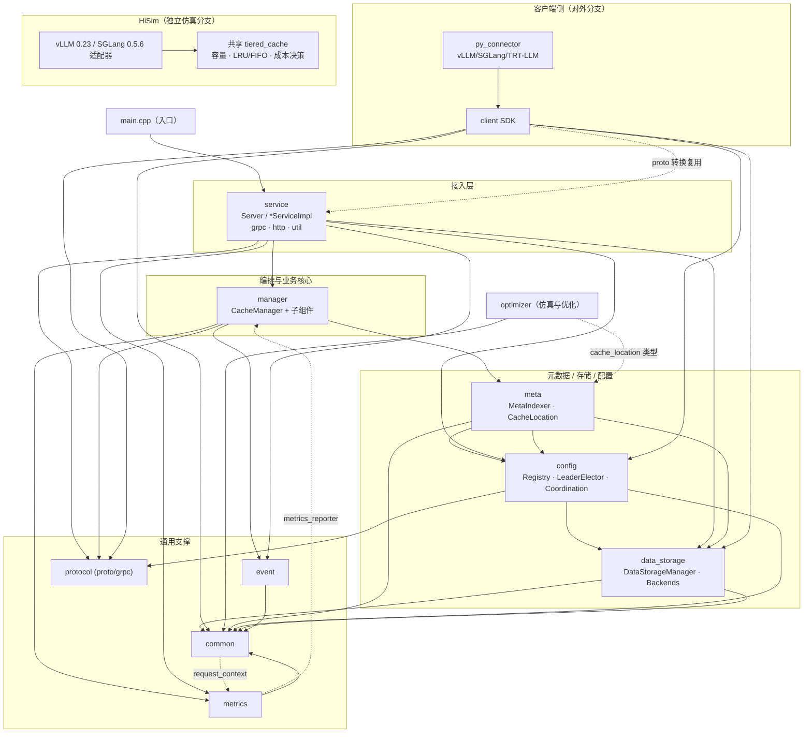
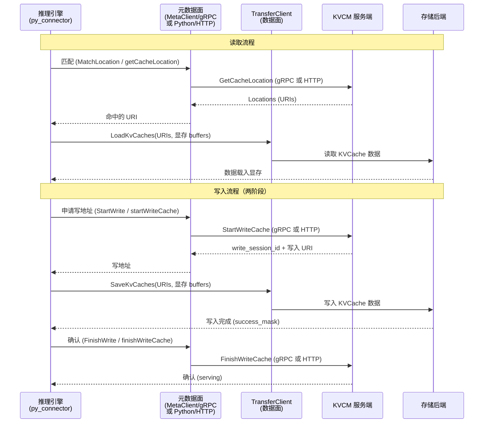

# 模块架构与关联关系

本文档描述 Tair KVCache 各模块的职责，以及模块之间的关联关系（依赖方向、控制流、数据流）。目的是在修改或新增功能时，能快速判断当前模块受哪些模块约束、又会影响到哪些模块，避免遗漏关联模块带来的隐性约束。

> **维护提示**：当模块的职责、依赖方向或调用关系发生变化，或新增/删除模块时，请同步更新本文档与文末的 Mermaid 图，并同步更新 [AGENTS.md](../../AGENTS.md) 中的缩略图。

相关文档：[基本概念](basic_concepts.md)、[高可用与选主机制](ha_leader_elector.md)、[配置指南](../configuration.md)、[优化器文档](../optimizer.md)。

---

## 1. 系统概览

仓库包含三个相对独立的部分：

| 部分 | 路径 | 说明 |
|---|---|---|
| **KVCache Manager** | `kv_cache_manager/` | 核心系统：全局 KVCache 元数据管理服务，以及配套的客户端 SDK 与推理框架连接器。本文档的主体。 |
| **HiSim** | `hisim/` | 独立的 LLM 推理仿真系统，通过回放 trace 预测 TTFT/TPOT/吞吐等指标；vLLM 0.23 与 SGLang 0.5.6.post2 的适配器复用同一 HBM/DRAM/SSD 策略核心，不依赖 Manager 运行时。 |
| **Optimizer** | `kv_cache_manager/optimizer/` | 缓存仿真与优化：回放 KVCache 访问 trace，模拟命中率与容量消耗，指导逐出策略与容量参数调优。在线化能力正在开发中，后续会与现有 optimizer 合并。 |

KVCache Manager 采用中心化部署，负责 KVCache 的全局元数据管理（查询、写入、容量管理），推理引擎通过 Client/Connector 接入。

---

## 2. 模块职责

以下模块均位于 `kv_cache_manager/` 下。

### 服务端核心（自上而下的调用链）

| 模块 | 目录 | 职责 |
|---|---|---|
| **入口** | `main.cpp` | 构造 `CommandLine` 并运行，唯一依赖 `service`。 |
| **service** | `service/` | 接入层。`Server` 在启动时创建并串联几乎所有组件（整个服务的装配入口）；`*ServiceImpl`（meta/admin/debug）实现与传输无关的业务入口，`grpc_service/`、`http_service/` 是对应传输适配层，`util/` 负责 proto↔领域对象转换、调用守卫与访问日志。 |
| **manager** | `manager/` | 编排层与业务核心。`CacheManager` 是中心门面，对外提供注册实例、查询/写入/删除 Cache、上报事件、容量回收等能力，并协调 `MetaSearcher`、`WriteLocationManager`、`DataStorageSelector`、`CacheReclaimer`、`SchedulePlanExecutor` 等子组件。 |
| **meta** | `meta/` | 元数据平面。`MetaIndexerManager` 按 `instance_id` 管理 `MetaIndexer`，维护 cache key → `CacheLocation` 的索引；元数据后端可插拔；`meta_search_cache` 做查询缓存。`CacheLocation` 是被广泛共享的核心类型。 |
| **config** | `config/` | 配置模型 + 注册表 + HA 协调层。定义各类配置对象；`RegistryManager` 持久化实例注册信息；`CoordinationBackend` + `LeaderElector` 提供一主多备的分布式选主。 |
| **data_storage** | `data_storage/` | 可插拔的 KVCache 数据存储后端。`DataStorageManager` 管理后端集合，`DataStorageBackend` 抽象存储介质，`DataStorageUri` 统一位置描述。 |

### 通用支撑模块（被多层复用）

| 模块 | 目录 | 职责 |
|---|---|---|
| **common** | `common/` | 基础设施层：日志、JSON、错误码、Redis 客户端、`RequestContext`（逐请求追踪上下文）、`concurrent_hash_map`、`lru_cache`、`loop_thread`、服务发现、崩溃处理等。几乎所有 C++ 模块都依赖它。 |
| **metrics** | `metrics/` | 可观测性。`MetricsRegistry`/`MetricsCollector` 收集指标，多种 reporter（kmonitor/local/logging/dummy）上报，`PrometheusExporter` 通过 HTTP 暴露。 |
| **event** | `event/` | 轻量事件总线。`EventManager` 将领域事件（如 cache 回收事件）分发给注册的 `EventPublisher`（默认 `LogEventPublisher`）。 |
| **protocol** | `protocol/protobuf/` | gRPC/proto 契约。定义 meta/admin/debug/kv_meta 服务，生成 C++ 与 Python 桩。 |

### 客户端与连接器

| 模块 | 目录 | 职责 |
|---|---|---|
| **client** | `client/` | C++/Python 客户端 SDK，是推理引擎与 KVCM 之间的桥梁。对外提供 `ManagerClient`/`RTPLLMClient` 门面，内部由两条链路组成（见下）：**元数据面** `MetaClient`（经 gRPC 桩 `internal/stub` 调用 KVCM 服务）与**数据面** `TransferClient`（经 `internal/sdk` 在推理引擎显存/内存与存储后端之间搬运 KVCache 数据）。面向外部，不被服务端核心调用。 |
| **py_connector** | `py_connector/` | 推理框架集成（Python）。将 client 接入 vLLM/SGLang/TRT-LLM，含 CUDA kernel 辅助，负责在引擎的推理流程中按正确顺序调用元数据面与数据面接口。此外自带一个纯 Python 的 HTTP 元数据面客户端 `KvCacheManagerClient`（`common/manager_client.py`），作为 C++ `MetaClient` 之外的另一条元数据面通路。位于 Python 侧栈顶。 |

> **三个面的界定**：本文档区分三个面——**元数据面**指 MetaService 的接口（`GetCacheLocation`/`StartWriteCache`/`FinishWriteCache`/`GetCacheMeta`/`RemoveCache`/`RegisterInstance` 等）及 client 侧调用这些接口的逻辑，是推理引擎读写 KVCache 的热路径；**数据面**指 KVCache 数据在引擎显存/内存与存储后端之间的实际搬运（`TransferClient`，不经过 KVCM）；**管控面**仅指 AdminService 的接口（Storage 增删改、Instance Group 管理、账号、配置快照、运维监控、Leader 运维等），供运维/管理工具使用，不在推理引擎的读写热路径上。

client 覆盖元数据面与数据面两条链路，其对应关系如下（管控面由 AdminService 承载，不属于 client SDK 的常规链路）：

| 链路 | 组件 | 依赖 | 对应 KVCM 服务端接口 |
|---|---|---|---|
| 元数据面 | `MetaClient` → `internal/stub:grpc_stub` | `protocol`、`config`、`service/util:manager_message_proto_util` | MetaService：`GetCacheLocation` / `StartWriteCache` / `FinishWriteCache` / `GetCacheMeta` / `RemoveCache` 等 |
| 数据面（数据搬运） | `TransferClient` → `internal/sdk` | `data_storage`（URI/common_define）、`common` | 不经过 KVCM，直接读写存储后端 |

**元数据面到 KVCM 有两条等价通路**，最终都落到服务端同一套 `*ServiceImpl`（`grpc_service`/`http_service` 只是传输适配层）：

1. **C++ `MetaClient`（gRPC）**：走 `internal/stub:grpc_stub`，供 C++ 侧与经 pybind 的引擎使用。
2. **Python `KvCacheManagerClient`（HTTP）**：位于 `py_connector/common/manager_client.py`，用 `requests` 访问 KVCM 的 `/api/*` 端点（`getCacheLocation`/`startWriteCache`/`finishWriteCache`/`registerInstance`/`removeCache`/`trimCache`/`getClusterInfo`），并自带 Leader 发现（`/api/getClusterInfo` → `leader_endpoint.meta_http_port`）与 `SERVER_NOT_LEADER` 重试。不同连接器按需选用其一。

数据面则统一走 C++ `TransferClient`（经 pybind），与元数据面选哪条通路无关。

client 通过 `InitParams.role_type` 区分角色：**SCHEDULER**（调度节点）只创建 `MetaClient` 做元数据匹配与写地址申请；**WORKER**（推理节点）只创建 `TransferClient` 做数据搬运；**HYBRID** 两者都有。WORKER 的存储配置由 `MetaClient::GetStorageConfig()` 从 KVCM 下发获得，保证与服务端一致。

---

## 3. 依赖方向与关联关系

### 3.1 核心依赖链

服务端核心是一条清晰的单向下降链：

```
service → manager → meta → config → data_storage → common
```

- `common`、`protocol` 是最底层的通用模块，被各层广泛依赖。
- `metrics`、`event` 是通用支撑模块，被 `manager` 与 `service` 复用。
- `service` 在启动时实例化 `CacheManager`（注入 `MetricsRegistry` + `RegistryManager`），并通过 `config` 的 `LeaderElector` 门控 recover/cleanup。

### 3.2 需要特别注意的反向边（近似环）

修改这两处时要特别小心，它们是有意为之的“向上依赖”，通过拆分细粒度 Bazel target 才避免了真正的循环依赖：

1. **`common:request_context` → `metrics:metrics_collector`**：`RequestContext` 会直接采集指标，因此 common 反向依赖 metrics 的采集器 target。
2. **`metrics:metrics_reporter` → `manager:cache_manager`**：reporter 需要读取实时 cache 状态，因此 metrics 反向依赖 manager。由于 `manager` 依赖的是 `metrics_registry`/`metrics_collector`，而 reporter 位于独立的 `metrics_reporter` target，二者不构成 Bazel 环。

### 3.3 客户端与 Optimizer

- **client** 是独立的对外分支，仅共享 `common`、`config`、`data_storage`、`protocol` 以及 `service/util:manager_message_proto_util`；**py_connector** 通过 pybind 位于 client 之上。核心服务端不依赖 client。运行时，元数据面经 gRPC（C++ `MetaClient`）或 HTTP（py_connector 的 Python `KvCacheManagerClient`）调用 KVCM 服务，数据面经 C++ `TransferClient` 直接读写存储后端——这几条链路是理解端到端流程的关键（见第 4 节）。
- **optimizer** 负责 KVCache 访问 trace 的仿真与优化（命中率/容量分析、逐出与容量参数调优）。目前通过 `meta:cache_location` 类型与 `event` 的 optimizer 事件与核心关联；在线化能力正在开发中，后续会与现有 optimizer 合并。

### 3.4 HiSim 框架适配与共享多级缓存

HiSim 保留推理框架的调度与 KV block/page 控制流，只替换模型执行并注入性能模型。框架适配器
位于 `hisim/src/hisim/simulation/vllm/` 和 `hisim/src/hisim/simulation/sglang/`；二者共同依赖
`hisim/src/hisim/simulation/tiered_cache.py`，后者统一负责 DRAM/SSD 容量、LRU/FIFO、连续前缀、
提升/降级、持久化、预取成本和读取与重计算决策。

vLLM 通过 0.23 的 KVConnector/SchedulerOutput 适配；SGLang 通过固定 0.5.6.post2 的
HiRadixCache/HiCacheController/storage backend 适配。SGLang native host pool 在共享策略模式下仅作
传输暂存，不能绕过逻辑 DRAM/SSD 容量。两条路径都把 `instance_id` 写入 cache namespace，禁止
跨 Instance 复用。详细设计见 `hisim/docs/vllm_023_integration.md` 和
`hisim/docs/sglang_tiered_cache.md`。

### 3.5 模块关系图



图例：实线箭头表示“依赖 / 调用”；虚线箭头表示需要特别注意的反向边或弱耦合。

---

## 4. 关键运行时流程（控制流 + 数据流）

完整的端到端流程涉及三方：**推理引擎（经 py_connector）**、**client（元数据面 + 数据面）**、**KVCM 服务端**。关键点在于：**元数据操作走元数据面到 KVCM，实际 KVCache 数据搬运走数据面直连存储后端，二者不混**。KVCM 只管理“数据在哪、能不能读写”，不经手数据本身。元数据面到 KVCM 有两条等价通路——C++ `MetaClient`（gRPC）或 py_connector 的 Python `KvCacheManagerClient`（HTTP `/api/*`），下文以“元数据面”统称；数据面统一走 C++ `TransferClient`。

服务端内部流程都以 `RequestContext` 贯穿，指标采集在链路上逐层进行。HA 部署下只有 Leader 处理读写请求；client 先经 `GetClusterInfo` 发现 Leader 再直连（详见 [ha_leader_elector.md](ha_leader_elector.md)）。

### 4.1 服务端请求的通用路径

一次元数据面请求进入 KVCM 后：

```
client（MetaClient/gRPC）→ service（grpc 适配 → *ServiceImpl）
    → manager（CacheManager）→ meta（索引）/ data_storage（存储状态）→ common
```

### 4.2 实例注册

推理引擎启动时经 client 注册实例，`CacheManager::RegisterInstance` 校验并落库实例配置（block_size、location spec、模型部署等）到 `RegistryManager`（config），并在 `MetaIndexerManager` 中为该 `instance_id` 建立索引。**约束**：KVCache 仅在同一 `instance_id` 内复用，跨 Instance 不匹配。

### 4.3 读取（命中并加载 KVCache）

从完整视角看，读取由推理引擎驱动，client 的两条链路依次参与：

1. **匹配**：引擎经 `ManagerClient::MatchLocation`（元数据面）调用 KVCM `CacheManager::GetCacheLocation(sByBackend)`。KVCM 内部由 `MetaSearcher` 经 `meta_search_cache` 与 `MetaIndexer` 查得 `CacheLocation`，`DataStorageSelector` 依据后端可用性/水位选出返回哪个存储位置，返回一组存储位置 URI（`Locations`）。支持前缀匹配、滑动窗口匹配、批量匹配等查询类型。
2. **加载**：引擎拿到 URI 后，经 `ManagerClient::LoadKvCaches`（数据面 `TransferClient`）由对应 SDK 从存储后端把 KVCache 数据读入引擎显存/内存。此步**不经过 KVCM**。

### 4.4 两阶段写入（申请地址 → 写入 → 确认）

为保证数据可靠性，写入分两阶段，同样由引擎驱动、两条链路配合：

1. **申请写地址（StartWriteCache）**：引擎经 `ManagerClient::StartWrite`（元数据面）调用 KVCM `CacheManager::StartWriteCache`。KVCM 过滤掉已存在的 block，经 `DataStorageSelector` 选择存储后端，由 `WriteLocationManager` 生成写入地址，返回 `write_session_id` 与写入位置 URI，对应 `CacheLocation` 进入 `writing` 态。
2. **写入数据（SaveKvCaches）**：引擎经 `ManagerClient::SaveKvCaches`（数据面 `TransferClient`）把 KVCache 数据写入返回的存储位置。此步**不经过 KVCM**。
3. **确认（FinishWriteCache）**：引擎经 `ManagerClient::FinishWrite`（元数据面）回调 KVCM，`CacheManager` 依据 `success_block_mask` 将成功的 `CacheLocation` 置为 `serving` 并写入元数据索引；失败的 block 不会转正，保证只有真正写成功的数据可被后续读取命中。

### 4.4.1 端到端时序（读取与写入）



### 4.5 容量回收（后台异步）

`CacheReclaimer` 依据 Quota 与存储水位选出待逐出的 key，通过 `SchedulePlanExecutor`（后台线程池）异步删除 `data_storage` 中的数据并更新 `meta` 索引；删除不阻塞前台请求。回收动作通过 `event` 上报回收事件。

### 4.6 HA 故障转移

`LeaderElector`（config）基于 `CoordinationBackend`（memory/file/redis）的分布式锁选主。`Server` 在成为 Leader 时调用 `CacheManager::DoRecover` 恢复状态，降级时调用 `DoCleanup` 清理运行时状态（正在进行的写入按失败处理）。

---

## 5. 修改功能前的提示

修改某个模块前，先对照第 3 节的依赖关系图与第 4 节的运行时流程，确认它的上游（谁依赖它、会被它影响）和下游（它依赖谁、受谁约束），不要遗漏被依赖方带来的约束。尤其注意 3.2 的两条反向边、`CacheLocation` 的生命周期与状态流转约束，以及改动 `protocol` proto 时需遵循 [proto 修改指南](../develop/proto_modification_guide.md)。
